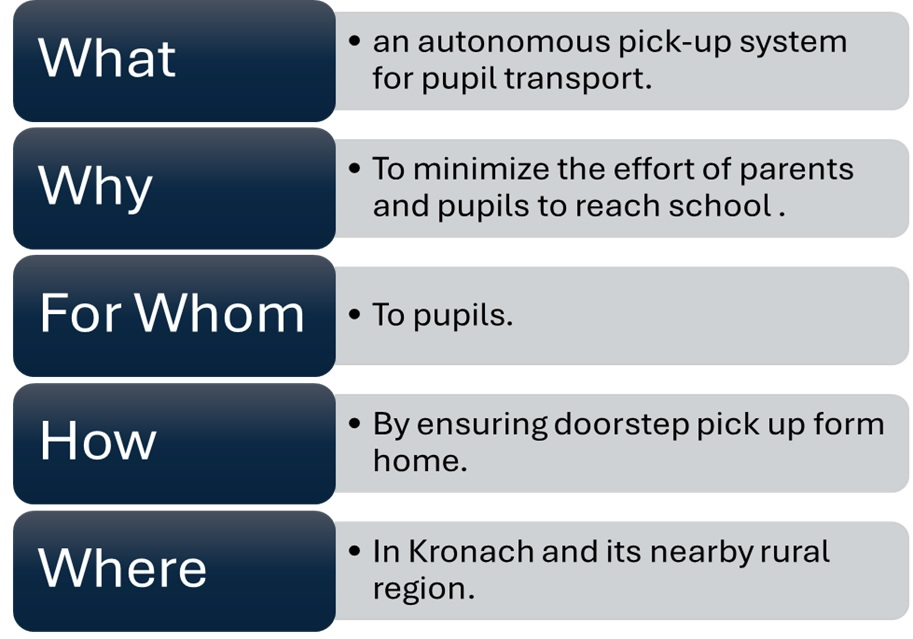
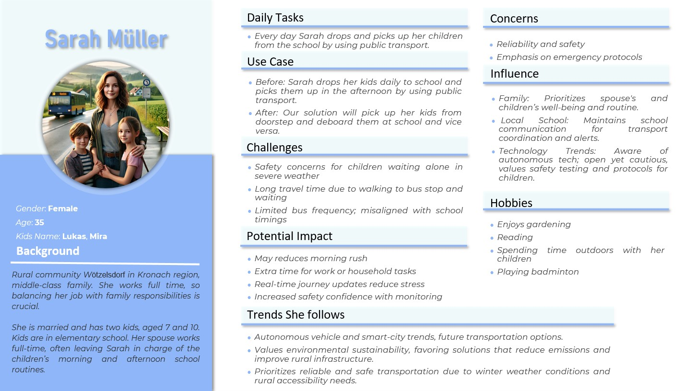
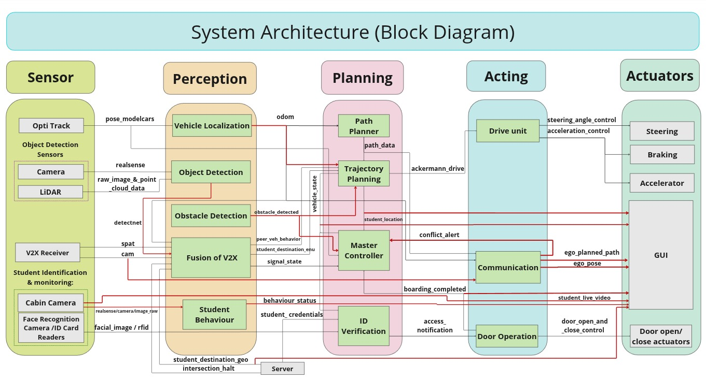
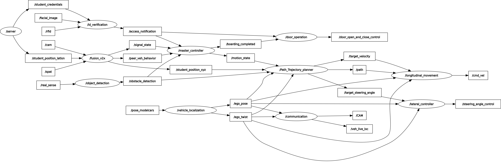
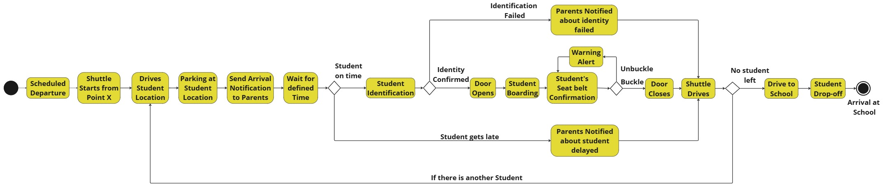
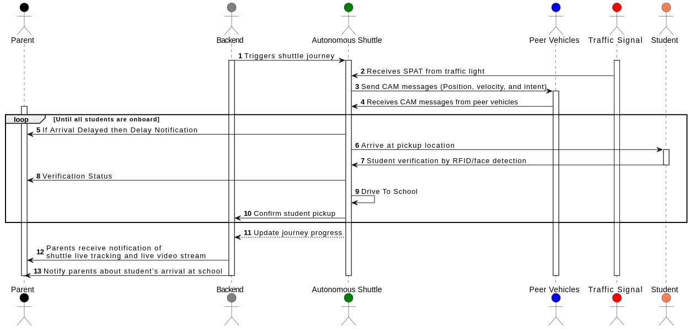
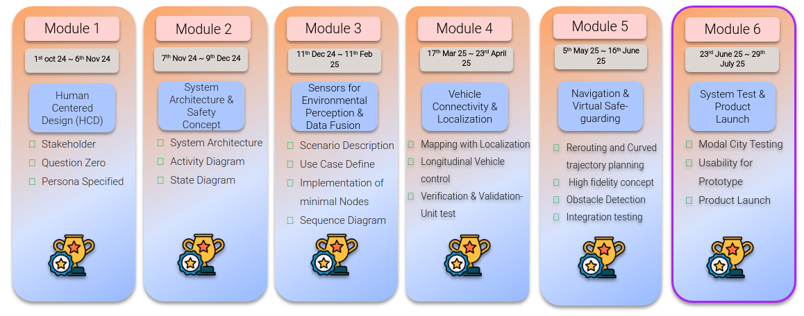
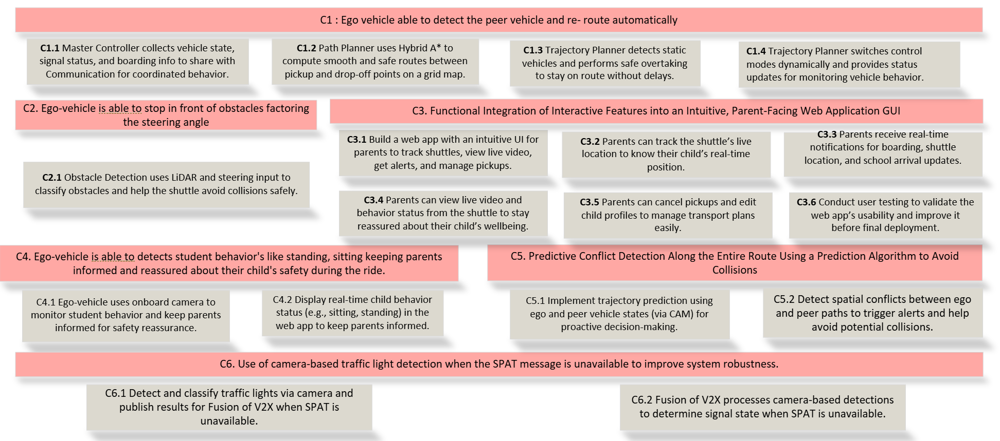

# Introduction
# 🚀 Meet The Elite

Pioneering the Future of Transportation
We are The Elite—a powerhouse team of seven visionary minds, fueled by curiosity, innovation, and a shared passion for problem-solving. Our expertise spans diverse domains, allowing us to break boundaries and engineer transformative solutions.

# 🌍 Our Mission

We're on a journey to redefine mobility with Autonomous Pupils Transport—a groundbreaking initiative aimed at revolutionizing student transportation through autonomy, safety, and efficiency. Guided by expert mentorship, we dive deep into the complexities of this challenge, shaping the future of smart, sustainable transit.

Join us as we push the limits of technology and turn bold ideas into reality. The road ahead is autonomous! 🚘✨

# Problem definition

## ❓ Question Zero
*How can we design an autonomous pick-up system for pupil transport in the Kronach region that minimizing the effort for parents and pupils to reach bus stops in rural areas where the frequency of public transport is very low, by ensuring doorstep pick up form home.*

The concept of Question Zero highlights the importance of understanding human needs and experiences from the very beginning of a project or design process. (see image below).

    

## 🎭 Persona
The Persona Method helps us deeply understand the needs, challenges, and behaviors of potential users. By crafting a fictional yet research-based user profile, we consolidate key insights into a typical end-user, ensuring our solution meets real-world demands.

## 👩 Meet Sarah Müller
Sarah Müller represents the everyday parent in rural Kronach—a mother juggling work, family, and daily logistics. With limited public transport options, she struggles to ensure her child reaches school on time without the stress of long walks or unpredictable bus schedules.

💡 Our mission? To create a seamless, autonomous transport solution that simplifies Sarah’s life—ensuring safe, doorstep pick-ups for her child while giving her peace of mind and convenience. 🚍✨ (see image below).

# 🏛️Architecture

## 🔄Block diagram
The system architecture of the autonomous school shuttle is structured into several key functional layers, as illustrated in the figure below. It begins with the Sensor Layer, which comprises hardware components such as OptiTrack for position tracking, along with cameras and LiDAR for object detection. Additionally, V2X receivers are integrated for real-time vehicle-to-everything communication. To ensure secure student identification and monitoring, the system incorporates a cabin camera with face recognition and ID card readers.

The collected sensor data is processed in the Perception Layer, where vehicle localization estimates the shuttle’s position and velocity, while object detection identifies obstacles in the environment. Furthermore, V2X data fusion with defined input interfaces (CAM and SPAT) and aligned output interfaces, enhances situational awareness by integrating information such as traffic signals, behaviors of nearby vehicles, and student positions. If the SPAT message from V2X doesn't work correctly, the system will fall back on a traffic light detection model using the camera to check if the signal is green or red. The former Student Behaviour component has been redesigned into an interface that streams in-cabin video directly to the GUI within the Actuator Layer. It also processes video from the cabin camera (based on Intel RealSense) using deep learning models like MediaPipe and MMAction2 to understand student poses. This helps detect whether a student is sitting or standing, and it publishes the result as a custom message on the /behaviour_status topic.

Within the Planning Layer, the system interprets perception data to guide decision-making and generate actions. Path and trajectory planning modules create safe, optimal routes with appropriate velocities, while a Master Controller handles motion execution, localization updates, and destination management. To further enhance safety, student credentials are validated via a Boarding Safe-Connect feature. Additionally, a new server connection has been introduced to provide direct access to student locations and credential data for both ID verification and the path planning component.

The Acting Layer transforms these plans into executable commands for both lateral and longitudinal movements. The communication component’s interfaces have been updated to publish V2X data to surrounding vehicles and share the shuttle’s live location with parents through the GUI.

Finally, in the Actuators Layer, these commands are executed through mechanisms such as steering, braking, and acceleration systems, supported by V2X transmitters for vehicle-to-vehicle communication and door actuators to facilitate safe boarding operations.

    

## RQT Graph-System Architecture

RQT Graph is a visualization tool in ROS2 used to display the communication structure of components. It shows how different ROS2 nodes interact with each other through subscribed and published topics and services. This helps to visualize the flow of information between different components of the system, making it easier to debug and analyze the system's architecture.

    

## 🔄State diagram
The state diagram provides a detailed overview of the different stages a shuttle goes through during its operation, focusing on its journey from being parked to completing its task of transporting students.The process begins with the "Parked" state, which is the shuttle's idle mode. In this state, the shuttle is stationary, not engaged in any activity, and waiting for the next set of instructions or a trigger to start its journey. This is the default or resting state of the shuttle. From the "Parked" state, the shuttle transitions to the "Driving State." This occurs when the shuttle is directed to move towards the student's location to pick them up. During this state, the shuttle is in motion, navigating its way to the designated pickup point. This is a crucial phase as it involves the shuttle actively traveling to ensure timely arrival at the student's location.

Once the shuttle arrives at the student's location, it enters the "Boarding State." In this state, the students board the shuttle. This phase is important as it involves the actual loading of passengers, ensuring that all students are safely and comfortably on board before the shuttle proceeds to the next stage. The diagram indicates that this state is complete once boarding is finished. After boarding is completed, the shuttle moves into the "Drop-Off state." In this state, the shuttle travels to the school location to drop off the students. This is the final active state in the shuttle's operation cycle, where it ensures that all passengers reach their destination safely.

Following the drop-off, the shuttle may return to the "Parked" state, completing the cycle and preparing for the next round of operations. This state diagram effectively captures the shuttle's workflow, highlighting the key stages and transitions involved in its operation.

    

## 🔄Activity diagram
The activity diagram describes a process related to student identification and notification, particularly focusing on what happens when a student is late or fails to be identified. The process starts with an attempt to identify the student, which unfortunately fails. As a result, the parent is notified about the identity issue. This notification triggers an alert, and the system begins to unbuckle, possibly indicating a preparation phase for further actions.

Next, the system checks the student's status from a specific point, referred to as Point X. This step is crucial for determining the student's current situation. The system then drives to gather the student's location and collects all student locations to ensure comprehensive tracking. Once the locations are known, the system sends an arrival notification to the parents. This notification is important for keeping parents informed about their child's status. The system then waits for a defined period to see if the student arrives on time. If the student is on time, their identity is confirmed, and the system proceeds to open the necessary access points, possibly for entering a school or a vehicle.

The student then engages in reading, and the system confirms that the student has fastened their seatbelt. This confirmation is a safety measure to ensure the student is secure. The door clauses are then activated, and the student is dropped off at the designated location.If no students are left to be processed, the system drives to the school. Upon arrival at the school, the student is dropped off, marking the end of the process for on-time students.However, if the student gets late, the system identifies them as another student, indicating a different process or set of actions might be required for late arrivals. This ensures that the system can handle various scenarios and keep all stakeholders informed and safe.

    

## 🔄Sequence diagram
This sequence diagram outlines the process of an autonomous shuttle system designed to transport students to school, with a focus on communication and coordination between different components. The process begins with a parent triggering the shuttle journey. Once initiated, the shuttle system enters a loop where it continuously communicates with traffic lights and other vehicles. The shuttle reserves Signal Phase and Timing (SPAT) from traffic lights to ensure smooth passage and sends Cooperative Awareness Messages (CAM) to share its position, speed, and intentions. It also receives similar messages from nearby vehicles to maintain awareness of its surroundings.

When the shuttle arrives at the pickup location, it verifies the student's identity using RFID or facial detection technology. Once the student is verified, the shuttle proceeds to drive to the school. Throughout the journey, the shuttle updates its progress, ensuring that the system is aware of its current status. The diagram also shows the involvement of peer vehicles, traffic signals, and the service updates they provide. Users, such as parents, can access live tracking and video streams of the shuttle through their mobile phones, allowing them to monitor the journey in real-time. However, there are moments when users might be unable to access their mobile phones, possibly due to connectivity issues or other constraints.

Overall, this sequence diagram illustrates a coordinated and automated system where the autonomous shuttle, traffic infrastructure, peer vehicles, and user notifications work together to ensure a safe and efficient transportation process for students.

    

## 🏗️Component responsibilities
| Component Name                        | Responsibility         |
|--------------------------------------|------------------------|
| [Vehicle Localization](https://git.hs-coburg.de/Team_ELITE/EL_Localization)       | Nirsitha               |
| [Obstacle Detection](https://git.hs-coburg.de/Team_ELITE/EL_Localization)         | Nirsitha               |
| [Object Detection](https://git.hs-coburg.de/Team_ELITE/EL_Object_Detection)       | Nirsitha/Siddhant               |
| [Fusion of V2X](https://git.hs-coburg.de/Team_ELITE/EL_Fusion_Of_V2X)             | Siddhant  
| [Server](https://git.hs-coburg.de/The_ELITE/TheElite_Server.git)             | Siddhant               |
| [Trajectory Planning](https://git.hs-coburg.de/Team_ELITE/EL_Path_Planner)        | Raja Annamalai         |
| [Master Controller](https://git.hs-coburg.de/Team_ELITE/EL_Controller)            | Nivetha 
| [GUI](https://git.hs-coburg.de/The_ELITE/TheElite_GUI.git)            | Nivetha             |
| [Path Planning](https://git.hs-coburg.de/Team_ELITE/EL_Main)                      | Rakesh                 |
| [ID Verification](https://git.hs-coburg.de/Team_ELITE/EL_Id_verification)         | Faizan Ahmed Raza      |
| [Student Behaviour](https://git.hs-coburg.de/Team_ELITE/EL_communication)         | Faizan Ahmed Raza            |
| [Door Operation](https://git.hs-coburg.de/Team_ELITE/EL_Door_Operation)           | Faizan Ahmed Raza      ||
| [Communication & Visualization](https://git.hs-coburg.de/Team_ELITE/EL_communication) | Anoop              |

# Documentation Project Management

## Tools
Team ELITE utilize Microsoft Teams and Outlook for communication, while MIRO serves as our platform for group discussions, brainstorming, and ideation. JIRA streamlines project management, and Microsoft Office ensures consistency in document preparation. For software development and learning, we rely on JupyterHub and GitHub. In this module we use Octave to solve basic mathmatical equations.

## Process
- Our project follows the Agile methodology as its development process.

## 📅Rituals
- After Module-5 retro, we identified some key issues in our working like more discussion than implementation. To resolve this, we start having timekeeper for any project related discussion.
- We made strict rule for dedicatedly working on project activity only during project hour.
- Early submission of project document for better preparation of pitch.

## 🏆Milestones
A well-defined timeline with clear milestones is essential for the successful development of the Autonomous pickup shuttle. These milestones ensure efficient resource allocation, timely progress, and serve as checkpoints to address challenges and align team efforts. By adhering to these key phases—ranging from initial design and system architecture to testing and product launch—the project maintains accountability, fosters collaboration, and delivers a safe, reliable solution tailored to user needs.

    

## 🗺️ Story Map
A story map is our blueprint for designing a seamless and efficient Autonomous Pupils Transport System. It breaks down complex features into structured themes, epics, and user stories—ensuring clarity, focus, and smooth execution.

🚍 Key Stages in the Transportation Process

1️⃣ Core Control & State Management
The high-level state machine (C1) enables ego-vehicle to detect peer vehicles and re-route automatically. It includes trajectory planning, control mode switching, and shared status communication.

C1.1 Master Controller collects vehicle state and signal status for coordinated behavior

C1.2 Path Planner uses Hybrid A* for safe routing

C1.3 Trajectory Planner overtakes static vehicles to avoid delays

C1.4 Trajectory Planner dynamically switches control modes and reports status

2️⃣ Obstacle Detection & Avoidance
Obstacle-aware navigation (C2) using LiDAR and steering input for safe operation.

C2.1 Ego-vehicle stops in front of obstacles factoring the steering angle

3️⃣ Parent-Facing Communication & GUI
An intuitive web application (C3) for parents to track, manage, and receive updates on their child’s shuttle experience.

C3.1 Build web app for shuttle tracking and pickup management

C3.2 Live location updates for real-time position tracking

C3.3 Notifications for boarding, location, and arrival

C3.4 Live video and behavior status for reassurance

C3.5 Pickup cancellations and child profile edits

C3.6 Usability testing and final validation

4️⃣ Student Behavior Monitoring
Ego-vehicle (C4) detects student behaviors like sitting/standing to keep parents informed during rides.

C4.1 Onboard camera monitors student behavior

C4.2 Display child behavior status in web app

5️⃣ Predictive Collision Avoidance
Proactive safety (C5) through trajectory prediction and spatial conflict detection.

C5.1 Predict conflicts using ego and peer vehicle state

C5.2 Alert generation to avoid potential collisions

6️⃣ Traffic Signal Interpretation
Camera-based traffic light detection (C6) ensures robustness when SPAT is unavailable.

C6.1 Classify traffic lights via camera and support V2X fusion

C6.2 Use camera-based detection to determine signal state in absence of SPAT

Each user story focuses on critical functionalities, such as:

✅ V2X & SPaT Integration for real-time traffic-signal compliance
✅ Ego–Peer Trajectory Fusion for proactive collision avoidance
✅ Intuitive Parent Communication via real-time updates and video feeds
✅ Safety Monitoring of onboard student behavior
✅ Reliable Traffic Light Detection through camera backup

    

## 📝Usecase
Sarah Müller is a working mother living in Wötzelsdorf, a rural community near Kronach, where public transportation is unreliable and infrequent. Every day, she struggles to balance her job with her responsibilities as a parent, ensuring that her two children, Lukas and Mira, reach school safely and on time. The existing transport system forces her to rely on irregular bus schedules, often requiring long walks to the nearest stop. On days when she is unable to drop them off, they have to walk to the bus stop by themselves, exposing them to harsh weather conditions and potential safety risks. The existing transport system is unpredictable, with irregular bus schedules and long wait times, adding to Sarah’s daily stress.

To address these challenges, an autonomous school shuttle service is introduced, providing a safe, reliable, and convenient transportation solution for Sarah and other parents in similar situations. The shuttle follows a predefined route, picking up children directly from their doorsteps without requiring parental supervision. As soon as Sarah’s children board the shuttle, she receives a notification confirming their entry, ensuring that they are safely on their way to school. Additionally, a live video streaming feature with a user-friendly GUI allows Sarah to monitor the journey in real time, giving her added peace of mind.

With this autonomous solution, Sarah no longer has to worry about her children walking to the bus stop alone or facing delays due to unreliable public transport. The system enhances safety, reduces her morning stress, and ensures her children have a secure and seamless journey to school every day.

    

## 🎬Scenario
Every morning, the autonomous school shuttle begins its journey from its designated starting location, following a predefined route generated by the system’s path and trajectory planning module. The first planned stop on the route is at Student 1’s residence. As the shuttle arrives, it performs automatic student ID verification before opening the doors. Once the student is safely onboard, the doors close, and a real-time notification is sent to the parents, providing confirmation of boarding along with access to live location tracking of the shuttle. The shuttle then proceeds to its second planned stop at Student 2’s house, where the same secure process is repeated—ID verification, automatic door opening, boarding, secure door closing, and notification to the respective parent. Throughout this journey, the shuttle maintains safe navigation through intersections and traffic zones by utilizing V2X communications and its integrated perception systems.

The third planned stop is at the residence of Sarah Müller. Upon arrival, the shuttle performs ID verification for Sarah’s child. After successful confirmation, the doors open automatically, allowing the child to board safely. As soon as the doors close securely, Sarah receives an immediate notification confirming boarding, along with access to the shuttle’s live location and a secure in-cabin video stream, allowing her to visually monitor her child during the journey.

During the trip toward the school, the shuttle encounters an unplanned event—a road unexpectedly closed due to emergency utility work. This obstruction is detected by the shuttle’s object detection sensors in combination with real-time V2X inputs. In response, the planning system recalculates a new optimal route to avoid the blockage while ensuring that the shuttle maintains its schedule as closely as possible. Parents, including Sarah, are instantly notified of the detour and provided with an updated estimated time of arrival through the GUI interface, maintaining full transparency and trust in the system.

Once all scheduled pickups are completed and the detour successfully managed, the shuttle proceeds to the school. Upon arrival, students safely disembark, and final notifications are sent to all parents confirming their children’s arrival. With this system in place, parents benefit from real-time visibility, continuous updates, and a highly reliable autonomous transport solution that ensures both student safety and parental peace of mind.

    

## 🎯Team roles and responsibilities
Our team is committed to project success through clear communication, timely delivery, and 
collaborative problem-solving. Each member has specific roles, from managing meetings and 
documenting progress to overseeing agile practices and ensuring team activities run smoothly. 
Together, we achieve collective growth and efficiency.
Here's how we organized our responsibilities:

| Responsibility          | Member |
|-------------------------|----------------|
| Project Management, Feedback jotting, Software Engineering | Faizan Ahmed Raza |
| Documentation (Goals, Protocols, Mails, Weekly-Presentations) | Anoop & Nirsitha |
| JIRA, retrospective | Siddhant |
| Timekeeper, Meeting rules and ensure every one is in meeting | Rakesh |
| Plan out and team activities, seeking help and assistance | Raja Annamalai |
| Assigning tasks and planning reviews | Nivetha |

## 📂Repository overview
- [Team_ELITE/EL_main](https://git.hs-coburg.de/Team_ELITE/EL_Main)
    - (Current repo)
    - In-depth documentation of the overall architecture
- [Repositories for each component](#component-responsibilities)
    - Component repos for each component of the architecture
    - In depth, *comprehensive* documentation of the respective *assigned* component *( (start) for grading)*
    - In depth documentation of the respective component
